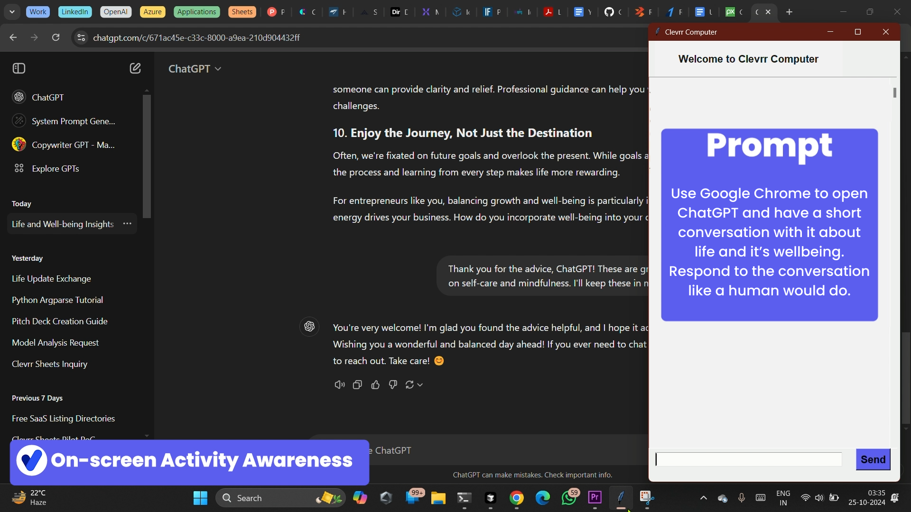
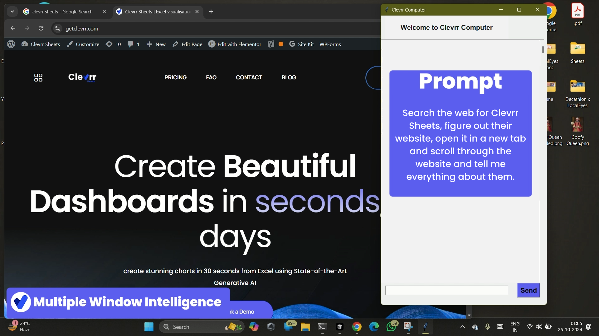
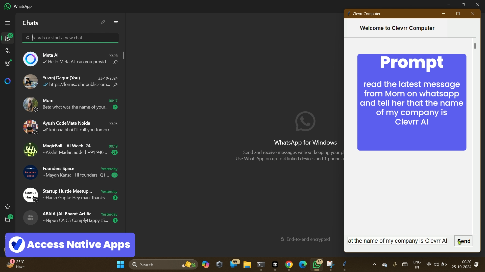

# Clevrr Computer

Clevrr Computer, inpired by  is an automation agent designed to perform precise and efficient system actions on behalf of the user using the PyAutoGUI library. It can automate keyboard, mouse, and screen interactions while ensuring safety and accuracy in every task.

## Features

- Automate mouse movements, clicks, and keyboard inputs.
- Take screenshots and manage windows.
- Handle errors gracefully and provide feedback.
- Execute tasks with maximum precision to avoid unintentional actions.

## Installation

> [!CAUTION]
> Clevrr Computer is a beta feature. Please be aware that Clevrr Computer poses unique risks that are distinct from standard API features or chat interfaces. These risks are heightened when using Clevrr Computer to interact with the internet. To minimize risks, consider taking precautions such as:
>
> - Use a dedicated virtual machine or container with minimal privileges to prevent direct system attacks or accidents.
> - Avoid giving the model access to sensitive data, such as account login information, to prevent information theft.
> - Limit internet access to an allowlist of domains to reduce exposure to malicious content.
> - Ask a human to confirm decisions that may result in meaningful real-world consequences as well as any tasks requiring affirmative consent, such as accepting cookies, executing financial transactions, or agreeing to terms of service.
>
> In some circumstances, Clevrr Computer will follow commands found in content even if it conflicts with the user's instructions. For example, instructions on webpages or contained in images may override user instructions or cause Clevrr Computer to make mistakes. We suggest taking precautions to isolate Clevrr Computer from sensitive data and actions to avoid risks related to prompt injection.


1. **Clone the repository:**

   ```bash
   git clone https://github.com/Clevrr-AI/Clevrr-Computer.git
   cd Clevrr-Computer
   ```

2. **Install dependencies:**

   ```bash
   pip install -r requirements.txt
   ```

3. **Set up environment variables:**

   Rename the `.env_dev` file to `.env` and add your API keys and other configurations:

   ```plaintext
   AZURE_OPENAI_API_KEY=<YOUR_AZURE_API_KEY>
   AZURE_OPENAI_ENDPOINT=<YOUR_AZURE_ENDPOINT_URL>
   AZURE_OPENAI_API_VERSION=<YOUR_AZURE_API_VERSION>
   AZURE_OPENAI_CHAT_DEPLOYMENT_NAME=<YOUR_AZURE_DEPLOYMENT_NAME>
   GOOGLE_API_KEY=<YOUR_GEMINI_API_KEY>
   ```

## Usage

1. **Run the Application:**

   You can run the application using the following command:

   ```bash
   python main.py
   ```

   By default, this will use the `gemini` model and enable the floating UI.

2. **Optional Arguments:**

    - **Choose a Model:**
    You can specify which model to use by passing the `--model` argument. Only acceptable args are `gemini` or `openai`.

    ```bash
    python main.py --model openai
    ```

    - **Floating UI:**
    The TKinter UI will be floating and remain on top of the screen by default. You can disable this behavior by passing the `--float-ui` flag as `0`. By default it will be `1`.

    ```bash
    python main.py --float-ui 0
    ```


## Examples










## How it works?
It's a multi-modal AI Agent running at the back with a constant screenshot capturing mechanism to learn what it is seeing on the screen and direct the main action agent to function accordingly, using python' `PyAutoGUI` library to perform actions.
- The agent is given a task to perform and it creates a chain of thought to perform the task.
- It uses the `get_screen_info` tool to get the information about the screen. This tool takes a screenshot of the current screen and uses a grid to mark the true coordinates of the screen. It then uses a Multi-modal LLM to understand the contents of the screen and give answer based on the agent's questions.
- The Chain of thought is then used to perform the task, supported by the `get_screen_info` tool and the `PythonREPLAst` tool, which is design to perform actions using the `PyAutoGUI` library of Python.


## Contributing

Contributions are welcome! Please fork the repository and submit a pull request for any improvements or bug fixes.

## Contact

For any questions or issues, please contact [yurvaj@getclevrr.com](mailto:yurvaj@getclevrr.com).